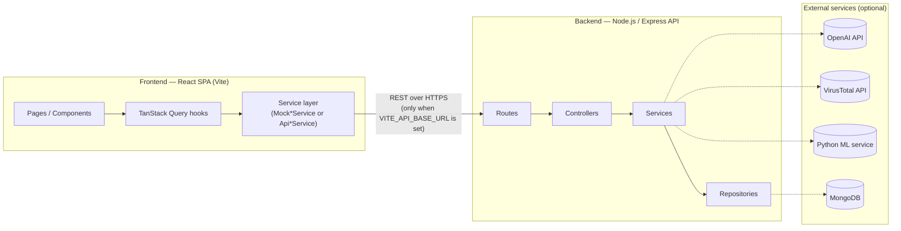
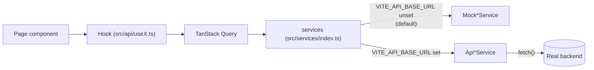
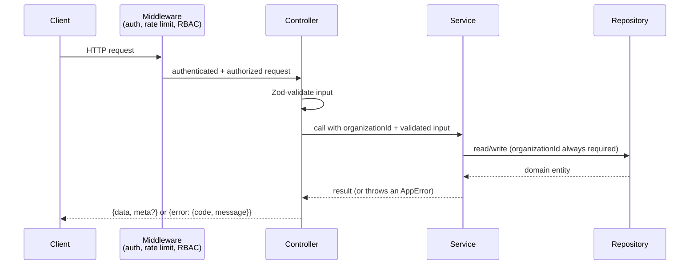
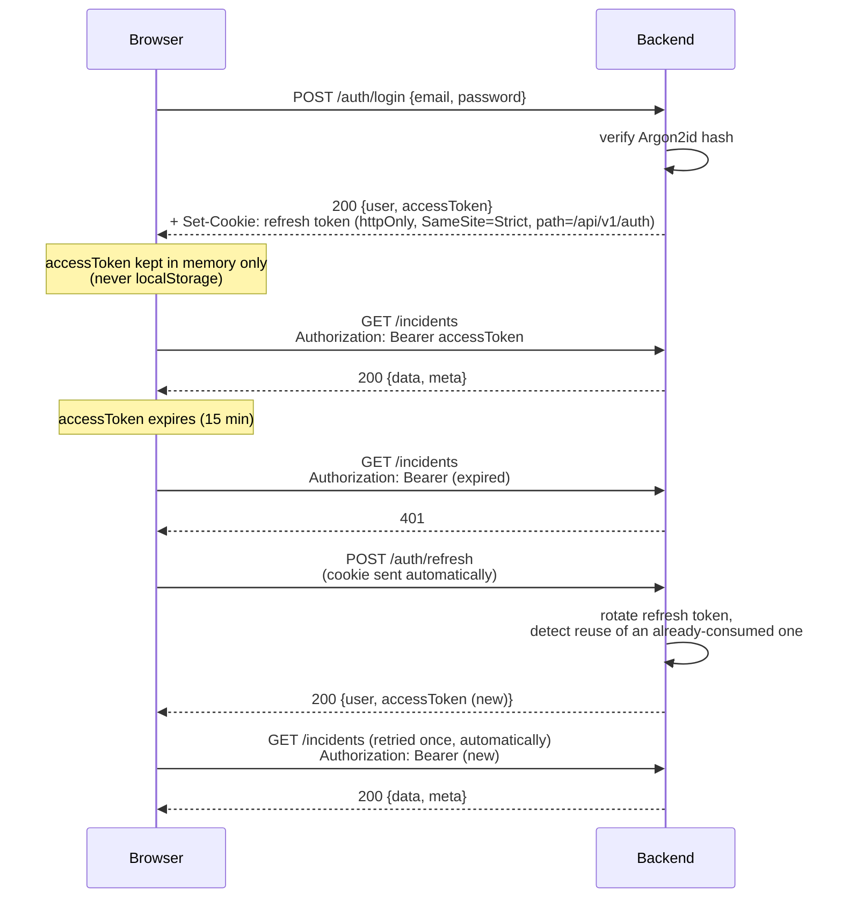
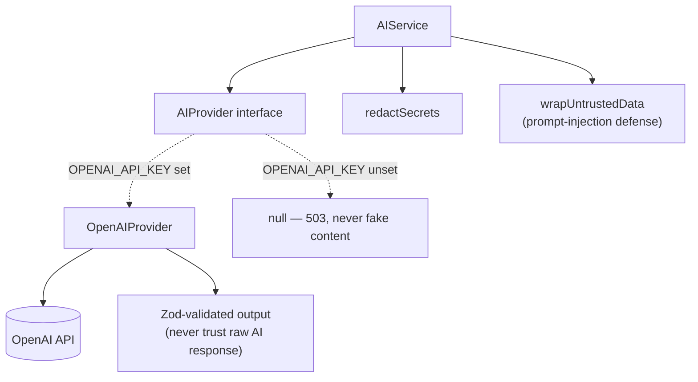
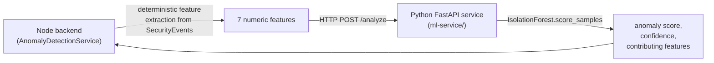

# Architecture

## 1. Overall architecture

ThreatLens is two independent applications that share a set of TypeScript type contracts by
convention (not by a shared package — see the note in §2):



The frontend can run **entirely on its own**, with no backend at all — every domain concept
(incidents, alerts, indicators, users, ...) has a `Mock*Service` implementation backed by
static/in-memory data, used by default. The backend can also run **entirely on its own** — it
has no dependency on the frontend, and is fully testable/usable via `curl` or any HTTP client.

This split exists on purpose: the frontend (Phases 1-2 of the build) was built and hardened
*before* the backend existed, against interfaces designed so a real backend could be dropped
in later without rewriting any UI code. Phase 12 ("full-system integration") is exactly that
drop-in — see §2 below.

## 2. Frontend architecture

```
src/
  api/          TanStack Query hooks (useIncidents, useAlerts, ...) — the only thing
                components should import to read/write data
  components/   Shared, reusable UI building blocks
  layouts/      AppShell (authenticated app chrome), AuthLayout, PublicLayout
  pages/        One folder per feature area, route-aligned (incidents/, alerts/, ...)
  routes/       React Router route tree + guards (ProtectedRoute, GuestRoute, RequireRole)
  services/     Domain-interface contracts (IncidentService, AuthService, ...)
    mock/       MockXService implementations — static/in-memory data, used by default
    api/        ApiXService implementations — real HTTP calls to the backend (Phase 12)
  hooks/        Auth context/provider, misc React hooks
  schemas/      Zod schemas for form validation
  types/        Domain entity types (Incident, Alert, User, ...) — the shared vocabulary
                every layer above speaks
  constants/    RBAC permission matrix, severity ordering, etc.
  animations/   Anime.js animation helpers
  mocks/        Static demo data consumed by the mock services
```

**Data flow, top to bottom**: a page imports a hook from `src/api/` (e.g.
`useIncidents()`); the hook wraps a TanStack Query `useQuery`/`useMutation` call whose
`queryFn`/`mutationFn` calls `services.incidents.list(...)`; `services` is resolved once, at
module load, in `src/services/index.ts`, to either the mock or real implementation. No
component or hook ever imports a `Mock*Service` or `Api*Service` directly — they only ever
see the shared interface. This is what makes the mock-to-real swap (Phase 12) possible without
touching any component.



**Why TanStack Query**: every list/detail view gets caching, background refetching, and
request de-duplication for free, and every mutation has a consistent
optimistic-update/invalidate-on-success pattern (see any `use*.ts` file in `src/api/`).

**Rendering strategy**: every route is lazy-loaded (`React.lazy` + `Suspense` in
`src/routes/AppRoutes.tsx`), so the initial bundle only includes what the landing/login pages
need — see the `dist/assets/*.js` chunk breakdown after `npm run build` for the actual split.

## 3. Backend architecture

```
backend/src/
  config/          env validation (fails fast on missing/invalid config), MongoDB connection
  middleware/      request ID, security headers/CORS, rate limiting, error handling, auth
  errors/          AppError hierarchy — the only errors ever described to a client
  auth/            login/register/refresh/etc., JWT signing/verification, RBAC permission matrix
  security/        low-level token helpers
  <domain>/        one folder per business domain (incidents, alerts, threatIntel, users,
                    organization, investigations, audit, mitre, threatGraph, ai,
                    anomalyDetection, responseWorkflow, reports) — each with its own
                    *.routes.ts, *.controller.ts, *.service.ts, *.schemas.ts, *.test.ts
  repositories/    one interface + InMemoryXRepository + MongoXRepository per entity,
                    all implementing the identical interface so services never change
                    depending on which backend is active
  database/models/ Mongoose schemas (only used when MONGODB_URI is set)
  types/           domain entity types — the backend's own copy of the shared vocabulary,
                    kept in sync with the frontend's src/types/ by hand
  utils/           logger (Pino, redacts secrets), API response envelope helpers
  routes/index.ts  mounts every domain's router under /api/v1
  app.ts           assembles the Express app from injected dependencies — no side effects,
                    safe to import directly in tests
  server.ts        the actual entry point: builds real repositories/providers based on env,
                    starts listening, handles graceful shutdown
```

**Request flow**: `routes.ts` (path + middleware) → `controller.ts` (parse/validate request,
call the service, shape the response) → `service.ts` (business logic, the only layer that
calls a repository or an external provider) → `repository.ts` (data access, always scoped to
one organization).



**Dependency injection**: `createApp(deps)` (in `app.ts`) takes every repository and provider
as an optional argument, defaulting to fresh in-memory instances. `server.ts` is the only
place that decides, from environment variables, whether to build Mongo-backed repositories or
in-memory ones, and whether to build a real `OpenAIProvider`/`VirusTotalProvider`/
`MlServiceProvider` or leave that slot `null`. Every test file constructs its own `createApp()`
call with exactly the repositories it needs, seeded with exactly the data it needs — nothing
is a shared global.

## 4. Authentication flow



Full detail — password hashing, token rotation/reuse detection, cookie scoping — is in
`docs/02-security.md`.

## 5. Authorization flow

Every request that isn't public passes through two gates, in order:

1. **`requireAuth`** — verifies the JWT, attaches `req.user = {id, organizationId, role}`.
2. **`requirePermission(permission)`** — checks `req.user.role` against a fixed permission
   matrix (`backend/src/auth/permissions.ts`) for the specific action the route represents.

The frontend has its own copy of the same matrix (`src/constants/roles.ts`) used only to hide/
disable UI the current user can't use — **that copy has no security value on its own**; the
backend's copy is the only one actually enforced. See `docs/02-security.md` for the full
matrix and the reasoning behind it.

A third, narrower check happens inside some services: **object-level authorization** — e.g.
assigning an incident validates the assignee belongs to the *same organization* as the
incident, not just that the caller has `incidents:assign`. This catches "the permission is
right but the target isn't" cases a route-level check can't see.

## 6. AI architecture



Nothing in the codebase calls the OpenAI SDK directly except `openaiProvider.ts` — every
consumer depends on the `AIProvider` interface. Full detail (redaction, prompt-injection
defense, structured-output validation, human-in-the-loop recommendations, cost/rate limiting)
is in `docs/04-ai-and-threat-intelligence.md`.

## 7. Threat intelligence architecture

Same provider-abstraction shape as AI: `ThreatIntelProvider` is an interface, `IOCService`
takes a **list** of them (not a single slot — spec: "do not tightly couple the application to
one provider"), and `VirusTotalProvider` is the one concrete implementation that exists today.
Full detail in `docs/04-ai-and-threat-intelligence.md`.

## 8. ML / anomaly-detection architecture



The ML service is a **separate, self-hosted Python process** (`ml-service/`), not a
third-party API — see `docs/04-ai-and-threat-intelligence.md` for how it's trained and scored,
and its own `ml-service/README.md` for how to run it.

## 9. Queue architecture

**Not built.** The spec names Redis + BullMQ for background job processing (IOC enrichment,
report generation, threat-feed sync). Every one of those operations currently runs
synchronously, in the request/response cycle, which is adequate at the scale this project has
been built and tested at. See `docs/07-deployment-and-operations.md` for what adding a real
queue would change.

## 10. Real-time architecture

**Not built.** No WebSocket/SSE layer exists; the frontend polls via TanStack Query's normal
refetch behavior. See `docs/07-deployment-and-operations.md`.

## 11. External services

| Service | Used for | Required? |
|---|---|---|
| OpenAI API | AI assistant, incident analysis, recommendations | No — degrades to a clean `503` |
| VirusTotal API | IOC enrichment | No — degrades to a clean `503` |
| Self-hosted Python ML service | Anomaly detection | No — degrades to a clean `503` |
| MongoDB / MongoDB Atlas | Persistent storage | No — falls back to in-memory storage with the same seeded demo data |

**None of these are required to run the application.** This is a deliberate architectural
property, not an oversight — see the "Optional dependencies" pattern described in
`docs/02-security.md` and `docs/04-ai-and-threat-intelligence.md`.

## 12. Major components and responsibilities

| Component | Responsibility | Does NOT do |
|---|---|---|
| Frontend service layer | Present a stable domain interface to the UI | Decide what's true — it just calls the backend (or mock data) |
| Backend controllers | Parse and Zod-validate the HTTP request, shape the response | Business logic |
| Backend services | Business logic, orchestration, calling providers/repositories | Talk to Express directly, or to a database driver directly |
| Backend repositories | Data access, tenant isolation | Business logic |
| `AIProvider`/`ThreatIntelProvider`/`AnomalyDetectionProvider` | Talk to one external system, translate its response into a typed, validated result | Decide what that result *means* for the platform (that's the calling service's job) |
| `AuditService` | Record what happened, who did it, when | Decide whether an action was allowed (that already happened by the time this runs) |
