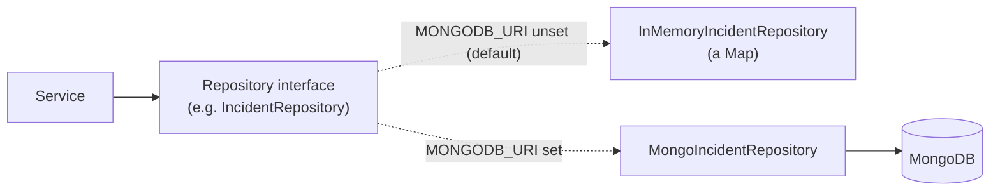
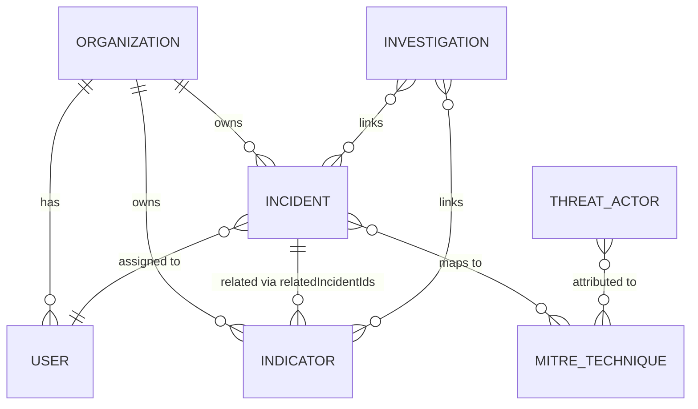

# Database

## 1. Architecture

ThreatLens uses **MongoDB** (via Mongoose) as its persistent store — but persistence itself is
optional. Every repository is defined as an interface first
(`backend/src/repositories/*.repository.ts`), with two implementations: an `InMemoryX`
version (a `Map`, used by default and throughout the test suite) and a `MongoX` version
(`*.repository.mongo.ts`). `server.ts` picks one or the other, for every repository at once,
based on whether `MONGODB_URI` is set — nothing else in the codebase (a controller, a service)
knows or cares which one is active, because both implement the exact same interface.

**Honest limitation**: the Mongo-backed path was written and unit-tested for shape/logic
correctness, but could not be exercised against a real running MongoDB instance in the
environment this project was built in (severe network throttling made downloading the test
binary for `mongodb-memory-server` impractical — confirmed by a partial download that stalled
at 211MB of a ~450–600MB binary). `backend/src/repositories/user.repository.mongo.test.ts`
contains a complete, real integration test suite written against `mongodb-memory-server` that
has never actually been run. **Run `npm run test:mongo` in `backend/` against a real
connection before relying on the Mongo path in production.**

## 2. Collections

| Collection | Model file | Seeded demo data? |
|---|---|---|
| `users` | `database/models/user.model.ts` | 5 users across 4 roles |
| `organizations` | `organization.model.ts` | 1 (`org_northwind`) |
| `incidents` | `incident.model.ts` | several |
| `alerts` | `alert.model.ts` | several |
| `indicators` | `indicator.model.ts` | 6 (IP/domain/URL/hash) |
| `investigations` | `investigation.model.ts` | 1 |
| `reports` | `report.model.ts` | several |
| `auditlogs` | `auditLog.model.ts` | none (starts empty — an empty trail at boot is correct) |
| `mitretechniques` / `threatactors` | `mitre.model.ts`, `threatActor.model.ts` | global reference data, same for every org |
| `securityevents` | `securityEvent.model.ts` | a demo behavioral history for one seeded user |

**Not Mongo-backed yet** — `Recommendation`, `AIAnalysis`, and `ResponseAction` remain
in-memory-only regardless of `MONGODB_URI`, the same tradeoff every collection had before its
own turn to be ported. This means AI recommendations, cached analyses, and response-action
records do **not** survive a server restart today, even in "MongoDB mode." See
`backend/README.md`'s Phase 6/10 sections.

## 3. Schema pattern

Every model is hand-written with an explicit TypeScript interface (`UserDoc`, `IncidentDoc`,
...) rather than Mongoose's `InferSchemaType` helper — that helper degrades badly for fields
using `enum`, `select: false`, or a custom string `_id`, which every model here has at least
one of. `_id` is a UUID string (`randomUUID()`), not MongoDB's default `ObjectId`, to match
the ID scheme already established by the frontend's mock data and every domain type — every
model declares `_id: { type: String, default: () => randomUUID() }` explicitly.

`passwordHash` on the `User` model is `select: false` — it's never included in a query result
unless a repository method explicitly asks for it (only the auth flow does).

## 4. Indexes

Every collection is indexed on `organizationId` — load-bearing for every single query, since
every repository method requires it (§5). On top of that, each collection has the compound
indexes its own documented list-filter/sort combinations actually use — for example,
indicators: `{organizationId, type}`, `{organizationId, severity}`, `{organizationId, value}`
(the most common single-value lookup for a threat-intel collection), and
`{organizationId, lastSeen}` for the default sort order. See each `*.model.ts` file's own
comment block for its specific index list and the reasoning behind it.

## 5. Relationships & tenant isolation

There are no MongoDB-level foreign-key constraints (Mongo doesn't have them) — relationships
are enforced in application code:

- Every repository method takes `organizationId` as a **required** first argument.
- Cross-references (an incident's `assignedAnalystId`, an investigation's linked incidents/
  indicators) are validated at the **service** layer against the same organization before
  being written — a reference to a real record in a *different* organization is rejected the
  same way a reference to a nonexistent record is.

Full detail and the reasoning behind "same `404` for missing vs. cross-tenant" is in
`docs/02-security.md` §4.

## 6. Data classification

| Class | Examples | Handling |
|---|---|---|
| Secrets | password hashes, reset-token digests | Argon2id / SHA-256 only, never plaintext, `select: false` where applicable |
| PII | user name, email | stored as plain fields — no field-level encryption today (see `docs/02-security.md` §5) |
| Security telemetry | incident/alert/indicator content, security events | stored as plain fields, treated as **untrusted content** wherever displayed or sent to an AI prompt (`docs/04-ai-and-threat-intelligence.md`) |
| Audit trail | who/what/when for every sensitive action | append-only, no update/delete code path exists |
| Reference data | MITRE techniques, threat actors | global, identical across every organization |

## 7. Retention

No automated retention/expiry policy exists yet — every collection grows indefinitely. This is
an acceptable posture for the demo/development scale this project has been built and tested
at; a production deployment handling real incident data would need a documented retention
policy (especially for the audit log, which regulatory requirements often mandate a *minimum*
retention period for) before going live.

## 8. Backups & restoration

Not implemented — this project doesn't manage its own MongoDB instance. If you're using
MongoDB Atlas, use Atlas's built-in continuous backup/point-in-time-restore. If you're running
MongoDB yourself, you're responsible for `mongodump`/`mongorestore` or your own snapshot
strategy — nothing in this codebase assumes or automates one.

## 9. Migrations

None exist, and none have been needed yet — every schema change so far has happened before any
real data existed against it. If you add a required field to an existing model with existing
data behind it, you'll need to write a one-off migration script; there's no migration
framework (e.g. `migrate-mongo`) wired in.

## 10. Vector storage

**Not built.** No vector index exists (see `docs/04-ai-and-threat-intelligence.md` §6 — RAG is
out of scope for what's shipped). If added later, this section is where the index name,
embedding model, and dimension would be documented.
