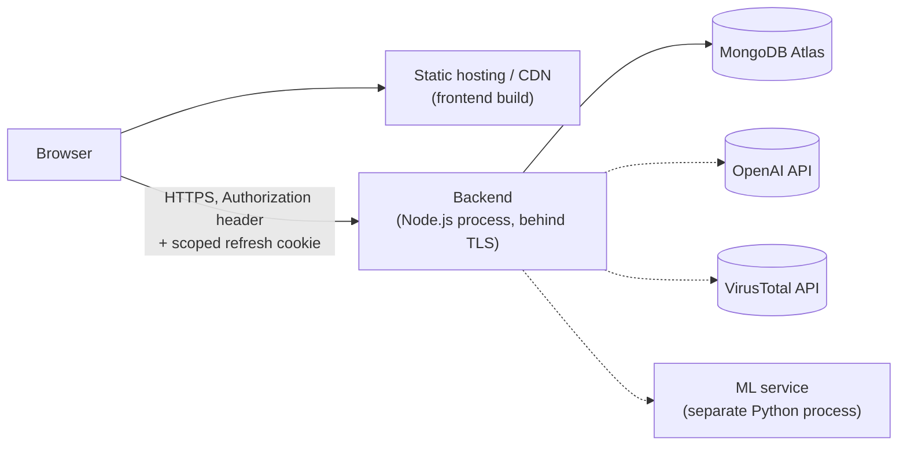

# Deployment & Operations

## 1. Production architecture



The frontend is a static single-page app (`npm run build` produces `dist/`) — deploy it to any
static host/CDN (Vercel, Netlify, S3+CloudFront, etc.). The backend is a standard Node.js
process — deploy it anywhere that runs Node (a VM, a container platform, a PaaS). They're
independent deployments; nothing about one requires the other to be redeployed.

## 2. Environment variables

**Backend** (`backend/.env` in development; set as real environment variables, not a
committed file, in production):

| Variable | Required | Purpose |
|---|:---:|---|
| `NODE_ENV` | | `development` \| `production` \| `test` — defaults to `development` |
| `PORT` | | defaults to `4000` |
| `CORS_ALLOWED_ORIGINS` | ✓ | comma-separated explicit allowlist — **never** a wildcard |
| `JWT_ACCESS_SECRET` | ✓ | ≥32 chars, generate with `node -e "console.log(require('crypto').randomBytes(48).toString('base64'))"` |
| `JWT_REFRESH_SECRET` | ✓ | same, must be a **different** value than the access secret |
| `MONGODB_URI` | | `mongodb://` or `mongodb+srv://` — unset means in-memory storage |
| `OPENAI_API_KEY` | | unset means AI features return `503` |
| `OPENAI_MODEL` | | defaults to `gpt-4o-mini` |
| `AI_DAILY_REQUEST_LIMIT_PER_ORG` | | defaults to `200` |
| `VIRUSTOTAL_API_KEY` | | unset means IOC enrichment returns `503` |
| `IOC_ENRICHMENT_STALE_AFTER_HOURS` | | defaults to `24` |
| `ML_SERVICE_URL` | | unset means anomaly detection returns `503` |

The full, current list with explanatory comments lives in `backend/.env.example` — that file
is the source of truth if this table ever drifts from it. The app **fails fast at startup**
(refuses to boot) if a required variable is missing or malformed — this is intentional; a
backend silently running with an invalid security configuration is worse than one that won't
start.

**Frontend** (`.env.local`):

| Variable | Required | Purpose |
|---|:---:|---|
| `VITE_API_BASE_URL` | | unset means the app runs entirely on mock data; set to the backend's versioned API root (e.g. `https://api.example.com/api/v1`) to use the real backend |

**Never commit a real `.env`/`.env.local` file** — both are listed in `.gitignore`. The
examples above use placeholders; substitute your own real values.

## 3. Deployment

No Dockerfile or automatic deploy-on-push exists (see §5 for the CI workflow that does exist —
it verifies every change, but doesn't deploy anywhere). To deploy manually:

**Backend:**
```bash
cd backend
npm ci
npm run build        # compiles TypeScript to dist/
npm start             # node dist/server.js
```

**Frontend:**
```bash
cd frontend
npm ci
npm run build         # produces dist/ — upload this to your static host
```

## 4. Docker

**Not used.** No `Dockerfile` or `docker-compose.yml` exists in this repository. Both apps are
plain Node.js processes and can be containerized with a standard multi-stage Node image if
needed — nothing about the codebase assumes or requires a container runtime.

## 5. CI/CD

A GitHub Actions workflow (`.github/workflows/ci.yml`) runs on every push/PR to `master`: five
independent jobs — `frontend` (typecheck, lint, test, build, in `frontend/`), `frontend-e2e`
(Playwright against a real production build, installing Chromium fresh each run), `backend`
(typecheck, lint, test, build, in `backend/`), `ml-service` (`pytest`, in `ml-service/`), and
`audit` (`npm audit --audit-level=high` in both `frontend/` and `backend/`). This is the exact
same quality gate every change in this project's history was held to manually
(`docs/06-development-and-testing.md` §8), now automated instead of relying on discipline
alone.

**Not yet added**: static-analysis/dependency-scanning tools beyond `npm audit` — Semgrep,
OWASP ZAP, and Dependabot are named in `docs/02-security.md` §18 as still-manual/unconfigured.
Also not configured: automatic deployment on a successful `master` build (this workflow only
verifies; it doesn't deploy anywhere) — wire that in once you've picked a hosting target (§1).

## 6. Secrets in production

Use your platform's real secrets manager (environment variables injected by your host, AWS
Secrets Manager, etc.) — never a committed file. Rotate `JWT_ACCESS_SECRET`/
`JWT_REFRESH_SECRET` periodically; rotating either one invalidates every existing session
(every access token stops verifying, every refresh token stops verifying), which is the
correct, expected behavior for a secret rotation, not a bug.

## 7. Database deployment

Use [MongoDB Atlas](https://www.mongodb.com/atlas) (recommended — handles backups, scaling,
and patching for you) or a self-managed MongoDB instance reachable over a `mongodb+srv://` or
`mongodb://` URI with authentication and TLS enabled. See `docs/05-database.md` for the schema
and the one path (`test:mongo`) you should run before trusting this in production.

## 8. Redis deployment

**Not applicable** — this project doesn't use Redis. The tech stack originally named Redis +
BullMQ for background job processing (IOC enrichment, report generation), but nothing built
so far needed it — every one of those operations runs synchronously today, which is fine at
current scale. If you outgrow that (enrichment calls blocking a request for too long under
real load, for example), that's the point to actually add a queue — not before.

## 9. Monitoring & logging

Structured JSON logs (Pino) to stdout, with a request-correlation ID on every line. In a real
deployment, ship stdout to your platform's log aggregation (CloudWatch, Datadog, a self-hosted
ELK stack, etc.) — nothing in this codebase does that shipping itself. No metrics/APM
integration or alerting exists yet.

## 10. Backups & restoration

Handled entirely by your MongoDB provider (Atlas's continuous backups, or your own
`mongodump`/snapshot strategy for a self-managed instance) — this project doesn't implement or
automate its own backup process. See `docs/05-database.md` §8.

## 11. Rollback

Standard process for a stateless Node.js service: redeploy the previous build/image. There is
no database migration framework yet (`docs/05-database.md` §9), so a rollback is safe as long
as no breaking schema change shipped in between — check that manually until a migration tool
exists.

## 12. Disaster recovery

Not formally documented or drilled. At minimum: your MongoDB provider's point-in-time restore
covers data loss; redeploying from the last known-good build/commit covers a bad deployment.
A real DR plan (RTO/RPO targets, a tested restore procedure) is future work.

## 13. Health checks

```
GET /api/v1/health   →  200 {"data": {"status": "ok", "uptimeSeconds": <number>}}
```

Unauthenticated, no dependencies checked (it doesn't verify MongoDB connectivity, for example)
— it confirms the process is up and serving requests. Point your platform's liveness probe at
this.

## 14. Scaling

The backend is stateless (no in-process session state beyond the optional in-memory
repositories, which only matter in the no-`MONGODB_URI` demo mode) — horizontal scaling behind
a load balancer works with a real MongoDB connection. **The in-memory repository mode is
explicitly not multi-instance-safe** — each process would have its own separate copy of the
data — so a production deployment should always set `MONGODB_URI`.

## 15. Maintenance

- Run `npm audit` (both `/` and `backend/`) periodically — see `docs/02-security.md` §18.
- Keep the demo/seed data in mind: every restart with in-memory storage resets to the seeded
  demo dataset. With `MONGODB_URI` set, seeding is upsert-based (idempotent) so restarting
  doesn't duplicate demo records, but it also doesn't remove data you've added since.
- Review `backend/README.md`'s per-phase "Not yet built" notes before assuming a capability
  exists in production that was only ever built as an honestly-labeled placeholder (the
  anomaly-detection model's synthetic training baseline and the response-workflow simulated
  executor are the two most consequential examples — see `docs/04-ai-and-threat-intelligence.md`).
